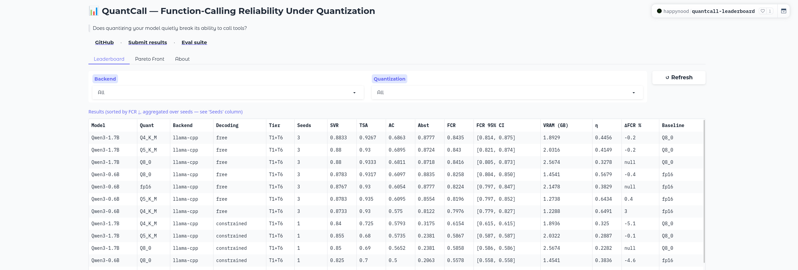
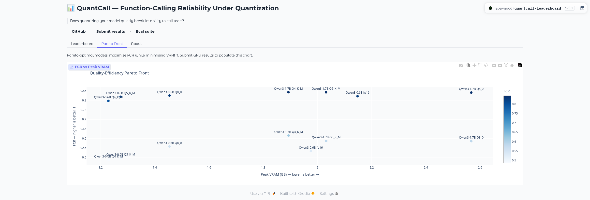

# QuantCall — Does Quantization Break Tool Calling?

[](https://github.com/Happynood/quant-toolcall-bench/actions/workflows/ci.yml)
[](https://www.python.org/)
[](LICENSE)
[](https://huggingface.co/spaces/happynood/quantcall-leaderboard)

> *"Quantizing a 0.6B tool-calling model down to Q4_K_M produces a real,
> statistically significant drop in argument correctness — but the same
> quant on a 1.7B model from the same family shows no significant
> degradation at all. Model size changes quantization sensitivity more
> than the quant level itself does. Find out on your own hardware, in one
> command."*

A reproducible benchmark measuring the degradation of function-calling / structured-output in open-weight LLMs under quantization and across inference backends.

---

## Leaderboard

Real results, run on an RTX 3050 Laptop GPU (4096 MiB VRAM) against BFCL v4
(T1 simple/multiple + T6 irrelevance, n=200/seed, 3 seeds, greedy decoding).
**Qwen3-0.6B was picked specifically because its fp16 weights (~1.5 GB) fit
a 4 GB card** — a genuine fp16 baseline, not a fallback. Qwen3-1.7B's fp16
(bf16, ~4.07 GB) does *not* fit at a usable context length (real CUDA OOM at
`n_ctx=4096` and `n_ctx=2048`; only loads at `n_ctx=512`, too small for
BFCL's tool-schema prompts — see [docs/RUN_REAL.md](docs/RUN_REAL.md)), so
**Q8_0 is its Δ reference precision**, labeled explicitly as `baseline_quant`
in the published data. With only 3 repeats per quant level, CIs are wide;
significance verdicts below come from bootstrapping the paired per-seed
delta itself (`scripts/delta_significance.py`), not just eyeballing overlap.
Raw per-seed results: [🤗 quantcall-results dataset](https://huggingface.co/datasets/happynood/quantcall-results).

| Model | Quant | SVR | TSA | AC | FCR (95% CI) | VRAM (GB) | ΔAC vs baseline |
|-------|-------|-----|-----|----|--------------| ----------|------------------|
| Qwen3-0.6B | fp16 (baseline) | 0.877 | 0.930 | 0.605 | 0.822 [0.797, 0.847] | 2.15 | — |
| Qwen3-0.6B | Q8_0 | 0.878 | 0.932 | 0.610 | 0.826 [0.804, 0.850] | 1.45 | −0.7% (not significant) |
| Qwen3-0.6B | Q5_K_M | 0.878 | 0.935 | 0.609 | 0.820 [0.797, 0.852] | 1.27 | −0.7% (not significant) |
| Qwen3-0.6B | Q4_K_M | 0.873 | 0.930 | 0.575 | 0.798 [0.779, 0.827] | 1.23 | **+5.0% (SIGNIFICANT, 95% CI [+2.6%, +7.3%] relative, excludes 0)** |
| Qwen3-1.7B | Q8_0 (baseline) | 0.880 | 0.933 | 0.681 | 0.842 [0.805, 0.873] | 2.57 | — |
| Qwen3-1.7B | Q5_K_M | 0.880 | 0.930 | 0.690 | 0.843 [0.821, 0.874] | 2.03 | −1.2% (not significant) |
| Qwen3-1.7B | Q4_K_M | 0.883 | 0.927 | 0.686 | 0.844 [0.814, 0.875] | 1.89 | −0.8% (not significant) |

**The real finding: quantization sensitivity depends heavily on model
size.** Qwen3-0.6B shows a statistically significant AC and FCR degradation
at Q4_K_M (bootstrap 95% CI on the delta excludes zero — see
`scripts/delta_significance.py` output in `docs/`). Qwen3-1.7B shows **no
significant degradation on SVR, AC, or FCR at any quant down to Q4_K_M** —
every CI on the delta crosses zero. This is reported as-is, without
manufacturing a clean monotonic story: bigger model, more quantization
headroom, at least across this quant range on this benchmark.

We also ran a constrained-decoding (GBNF) pass — full analysis, including a
real segfault we found and fixed in the process, in
[docs/constrained_decoding_findings.md](docs/constrained_decoding_findings.md).
Headline: it did **not** improve SVR/AC here, and abstention/FCR collapse
under it because the grammar structurally cannot express "don't call a
tool" — a genuine limitation of this GBNF implementation, disclosed rather
than hidden.

Live table + Pareto chart: [🤗 Space](https://huggingface.co/spaces/happynood/quantcall-leaderboard).

<p align="center">
  
  
</p>

---

## Quickstart

```bash
# Install (Python 3.11+)
pip install uv
git clone https://github.com/Happynood/quant-toolcall-bench
cd quant-toolcall-bench
uv sync

# Verify the installation (no GPU needed)
make verify

# Run the smoke evaluation (mock backend)
quantcall run --config configs/smoke.yaml --output results/smoke.json

# Real GPU evaluation — see docs/RUN_REAL.md for exact commands
```

---

## Metrics

| Metric | Description |
|--------|-------------|
| **SVR** | Schema-Validity Rate — are all emitted tool-calls structurally valid? |
| **TSA** | Tool-Selection Accuracy — correct tool names selected? |
| **AC** | Argument Correctness — correct argument values (AST-match)? |
| **Abst** | Abstention Accuracy — does the model correctly *not* call when irrelevant? |
| **FCR** | Function-Calling Reliability — weighted aggregate 0.25 × (SVR + TSA + AC + Abst) |
| **ΔFCR** | Absolute degradation vs fp16 baseline |
| **CDR** | Constrained-Decoding Recovery — fraction of degradation recovered by GBNF/xgrammar |
| **η** | Efficiency — FCR / peak VRAM (GB) |

---

## Dataset Tiers

| Tier | Source | Notes |
|------|--------|-------|
| T0 | In-repo smoke (10 instances) | Always available, no download |
| T1 | BFCL v4 simple_python + multiple | Manual JSON download from Berkeley (see `docs/RUN_REAL.md`) |
| T2 | BFCL v4 parallel + parallel_multiple | Manual JSON download |
| T6 | BFCL v4 irrelevance | Manual JSON download |
| T3 | ToolACE (`Team-ACE/ToolACE`) | CC-BY-NC 4.0 — manifest-only, no redistribution |
| T4 | xLAM ungated mirror (`minpeter/xlam-function-calling-60k-parsed`) | NC/gated — manifest-only; gated Salesforce source behind `use_gated_xlam: true` |
| T5 | Hermes function-calling v1 (`teknium/hermes-function-calling-v1`) | Apache 2.0; bundles glaive-function-calling-5k (credit both); reconstructed from source via manifest (not redistributed) |

---

## Supported Backends

| Backend key | Quant formats | Install |
|-------------|--------------|---------|
| `mock` | — | built-in |
| `llama-cpp` | GGUF Q4/Q5/Q8 | `uv sync --extra llama-cpp` |
| `transformers` | fp16, 8-bit, 4-bit (bitsandbytes) | `uv sync --extra transformers` |
| `vllm` | AWQ, GPTQ | `uv sync --extra vllm` |
| `openai` | any (remote endpoint) | `uv sync --extra openai` |

---

## Config Reference

```yaml
backend: llama-cpp          # mock | llama-cpp | transformers | vllm | openai
model: /path/to/model.gguf  # model path or HF repo ID
quant: Q4_K_M               # fp16 | Q8_0 | Q5_K_M | Q4_K_M | AWQ | GPTQ
tiers: [T1, T6]             # dataset tiers to evaluate
sample_size: 200            # instances per tier (null = all)
seed: 42
decoding: free              # free | constrained (GBNF, see docs/constrained_decoding_findings.md)
chat_variant: default       # default | qwen3_nothink (Hermes tool_call parser, suppresses <think>)
```

---

## Verification Gate

```bash
make verify
# Runs: ruff check, ruff format --check, pyright, pytest -q, smoke e2e
```

---

## Reproducing Results

Every `result.json` includes a manifest:

- Git commit SHA and dirty flag
- Config SHA-256
- Dataset sample SHA-256
- Hardware fingerprint (GPU name, driver, CUDA version)

---

## HuggingFace

| Artifact | URL |
|----------|-----|
| Eval suite (versioned samples) | [happynood/quantcall-suite](https://huggingface.co/datasets/happynood/quantcall-suite) |
| Results dataset (submit your runs) | [happynood/quantcall-results](https://huggingface.co/datasets/happynood/quantcall-results) |
| Live leaderboard | [happynood/quantcall-leaderboard](https://huggingface.co/spaces/happynood/quantcall-leaderboard) |

## Real GPU Evaluation

See [docs/RUN_REAL.md](docs/RUN_REAL.md) for exact GPU commands.

## Contributing

See [CONTRIBUTING.md](CONTRIBUTING.md) for the PR-based submission flow.

## Citation

```bibtex
@software{quantcall2026,
  title  = {QuantCall: Benchmarking Tool-Calling Reliability Under Quantization},
  year   = {2026},
  url    = {https://github.com/Happynood/quant-toolcall-bench}
}
```

## License

MIT, see [LICENSE](LICENSE).
